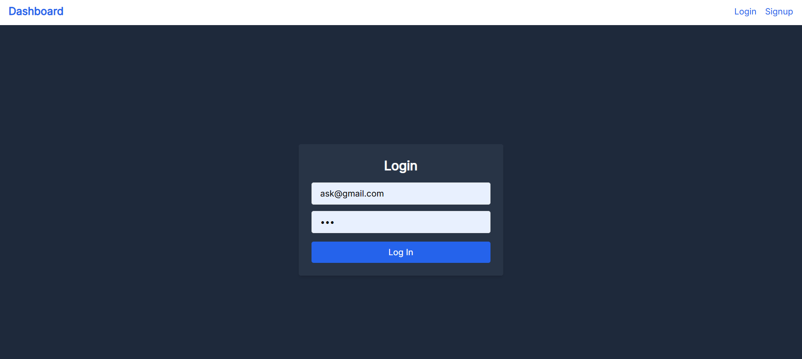
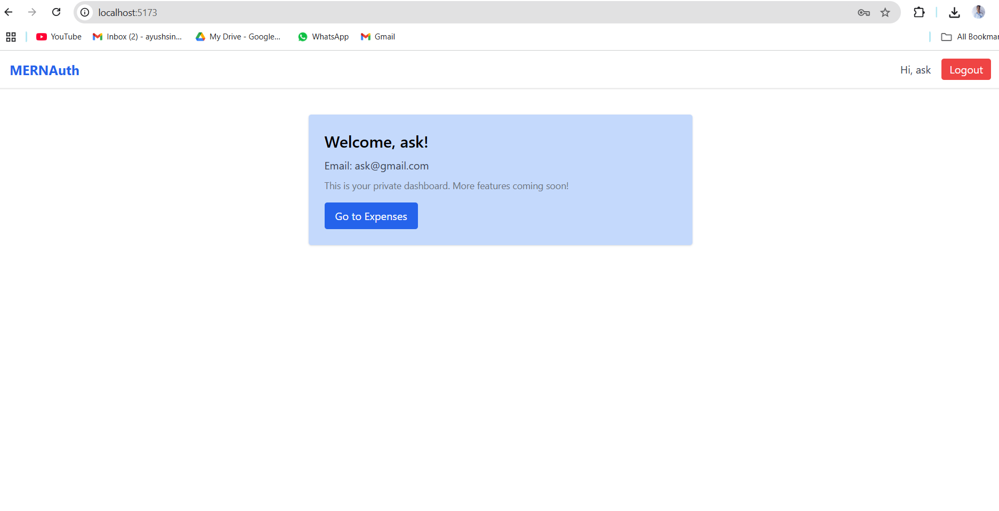
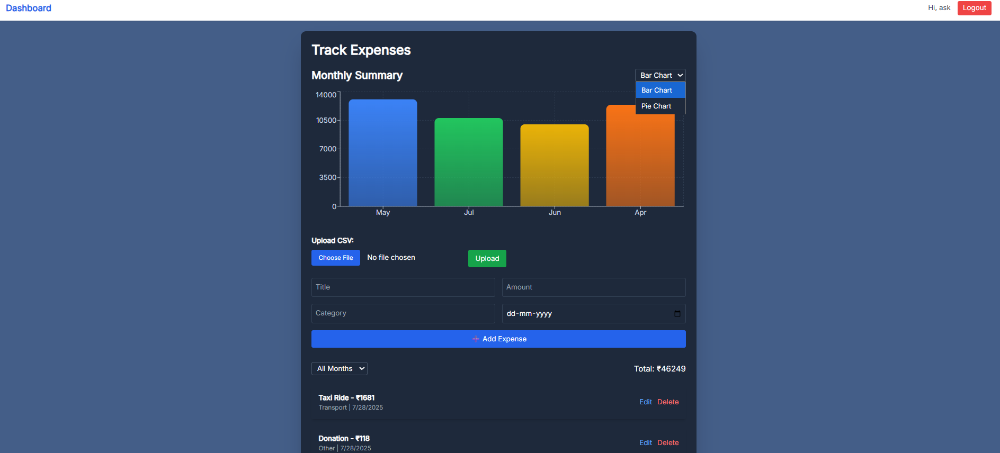
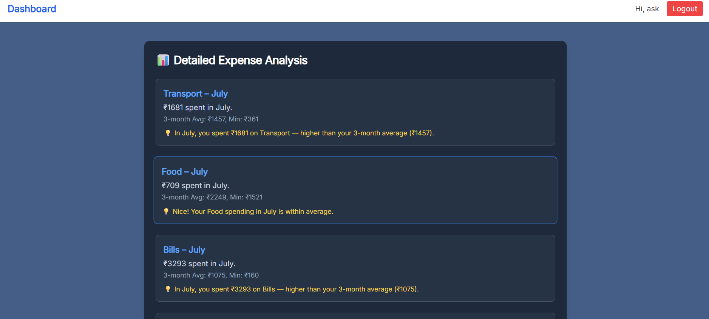

# 💸 SpendSense – Smart MERN Expense Tracker with Auth, Analytics & Suggestions

**SpendSense** is a full-stack **MERN-based Personal Finance Tracker** built with modern technologies. It provides **secure authentication**, an intuitive **expense dashboard**, and intelligent **trend-based suggestions** by analyzing your current month's spending against the past 3 months using MongoDB aggregations.

Alongside a clean interface and session persistence via HTTP-only JWT cookies, SpendSense also features **embedded financial widgets/ads** to provide relevant market insights.

---

## 🖼 Screenshots

### 🔐 Auth Pages  


### 💰 Expense Dashboard  


### 📊 Monthly Expense Chart + Entry


### 📊 Monthly Expense Suggestions 



---

## 🔥 Features

### 🔐 Authentication System
- Signup, Login, Logout
- JWT-based Auth with HTTP-only cookies
- Protected Routes + Persistent Login on Refresh
- Context API for global auth state
- Toast notifications for real-time feedback

### 💰 Expense Management
- Add, edit, delete expenses
- Categorize by title, type, and date
- View monthly expense summaries
- Real-time visualizations using `recharts`

### 📈 Smart Trend Analysis (New)
- Uses MongoDB Aggregation Pipelines
- Compares current month spending with past 3 months
- Highlights min/avg/max
- Gives personalized suggestions

### 🧠 Embedded Widgets
- Sidebar includes space for market widgets or ads
- Can be extended with live stock trackers or investment insights

---

## 🛠 Tech Stack

### Frontend
- React + Vite
- React Router DOM
- Tailwind CSS
- Recharts (Graphs)
- React Hot Toast

### Backend
- Node.js + Express
- MongoDB + Mongoose
- JWT + cookie-parser for secure sessions
- bcryptjs for hashing
- dotenv for config

---

## 🚀 Getting Started

### 1. Clone Repo

```bash
git clone https://github.com/your-username/spendsense.git
cd spendsense
```

### 2. Setup Backend

```bash
cd backend
npm install
npm run dev
```

Create a `.env` file in `/backend`:

```env
PORT=5000
MONGO_URI=your_mongodb_connection_string
JWT_SECRET=your_secret_key
```

### 3. Setup Frontend

```bash
cd frontend
npm install
npm run dev
```

> 🔗 Frontend: `http://localhost:5173`  
> 🔗 Backend: `http://localhost:5000`

---

## 📁 Folder Structure

```
spendsense/
├── backend/
│   ├── controllers/
│   ├── models/
│   ├── routes/
│   ├── utils/
│   └── server.js
├── frontend/
│   ├── components/
│   ├── context/
│   ├── hooks/
│   ├── pages/
│   └── main.jsx
```

---

## ✅ API Routes

### Auth
- `POST /api/auth/signup`
- `POST /api/auth/login`
- `GET /api/auth/me`
- `POST /api/auth/logout`

### Expenses
- `GET /api/expenses`
- `POST /api/expenses`
- `PUT /api/expenses/:id`
- `DELETE /api/expenses/:id`
- `GET /api/expenses/summary` _(aggregated trends)_

---

## 🙌 Acknowledgements

SpendSense is designed to demonstrate real-world MERN full-stack capabilities, including:
- JWT auth
- MongoDB aggregations
- State management
- Tailwind styling
- Chart visualizations

---

## 📃 License

Licensed under the [MIT License](LICENSE).
